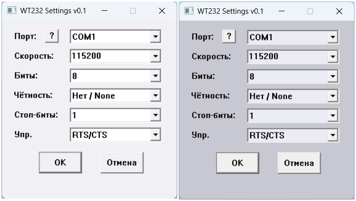
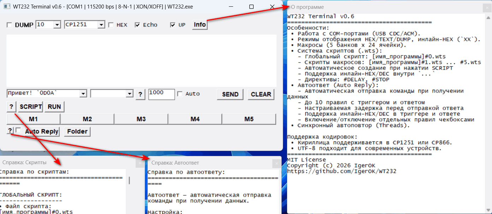
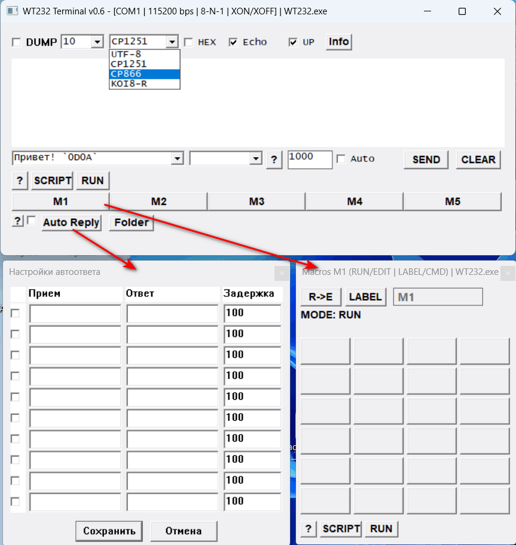
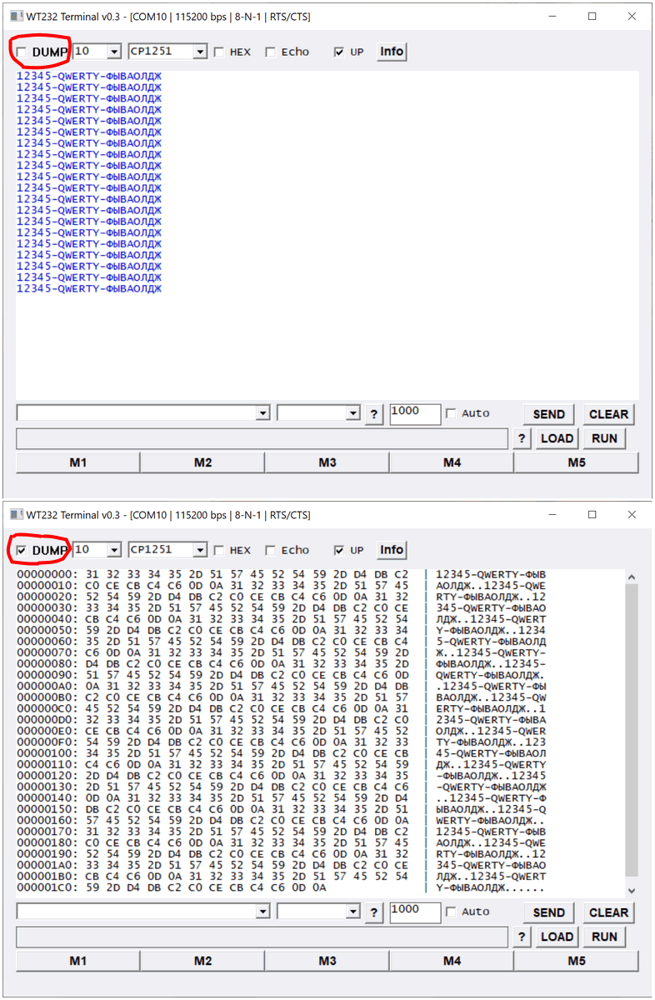

# WT232 Terminal v0.5

[](https://opensource.org/licenses/MIT)
[](https://www.microsoft.com/windows)
[](https://en.wikipedia.org/wiki/C_(programming_language))

**Простой многофункциональный терминал для виртуальных и COM-портов под Windows.**

---

## Скриншоты

### Стартовое окно (настройки UART)



### Главное окно терминала



### Режимы отображения



### Окно макросов с системой скриптов



---

## Описание

WT232 — универсальный Windows-терминал для COM-портов. Поддерживает TEXT/DUMP режимы, 120 макросов (5×24), систему скриптов с расширением `.wts`, автоподключение USB-устройств по VID/PID.

---

## Возможности

### Основные функции
- **Работа с COM-портами** (USB CDC/ACM, стандартные UART)
- **Режимы отображения приема**: TEXT (текст), DUMP (HEX + ASCII)
- **Режимы отправки**: TEXT с инлайн-HEX (в обратных кавычках `` `XX` ``)
- **Поддержка кодировок**: UTF-8, CP1251, CP866, KOI8-R (оптимизировано для кириллицы)
- **Автоподключение USB-устройств** по VID/PID/Serial Number
- **Многопоточная архитектура** (отдельные потоки Rx/Tx) для высокой отзывчивости
- **Поддержка пользовательской скорости** (Custom Baud Rate)

### Макросы (5 банков × 24 ячейки = 120 команд)
- **Режимы работы**: RUN (выполнение) / EDIT (редактирование)
- **Переключение отображения**: LABEL (имя) / CMD (команда)
- **Переименование банков** (только заголовок, без переименования файла скрипта)
- **Сохранение** в INI-файле

### Система скриптов (.wts)
- **Глобальный скрипт**: `[имя_программы]#0.wts`
- **Скрипты макросов**: `[имя_программы]#1.wts` ... `[имя_программы]#5.wts`
- **Автоматическое создание** при нажатии SCRIPT (с примером)
- **Инлайн-HEX/DEC** внутри `` `...` ``
- **Директивы**: `#DELAY`, `#STOP`
- **Циклическое выполнение** (без #STOP)

### Интерфейс
- **Кнопки скриптов**: `[?] [SCRIPT] [RUN]` (слева)
- **Чекбокс UP**: окно всегда поверх других
- **Чекбокс HEX**: отображение отправленных данных в HEX-формате в окне эха
- **Чекбокс DUMP**: переключение режима приема между текстом и дампом
- **Настраиваемый размер шрифта** (8–16 pt)
- **Суффиксы отправки** (автоматическое добавление CR/LF или HEX-байтов)

### Управление потоком (Flow Control)
- `NONE` — без управления
- `RTS/CTS` — аппаратное рукопожатие
- `XON/XOFF` — программное управление
- `RTS Toggle` — переключение RTS (RS-485)
- `RTS Toggle (Inverted)` — инвертированное переключение RTS

---

## Системные требования

- **Windows 7** и выше
- **32-бит (x86)** или **64-бит** (совместимость)

---

## Сборка из исходных кодов

Проект разработан в среде **Pelles C for Windows, версия 14.10**.

> ⚠️ **Важно**: Исходный файл `main_v0.5.c` сохранен в кодировке **UTF-16 LE (with BOM)**. Это необходимо для корректной обработки широких строк (wchar_t) и кириллицы в режиме Unicode. При редактировании файла убедитесь, что ваш редактор поддерживает эту кодировку и не конвертирует её в UTF-8 автоматически.

### Для сборки:

1. Установите [Pelles C](https://www.pellesc.de/)
2. Откройте файл проекта `WT232.ppj`. При необходимости подключите в проекте нужный файл `main.c`
3. Выберите конфигурацию сборки: **Release** или **Debug**
4. Нажмите **Build (F7)**

### Конфигурации сборки:

| Режим | Описание |
|-------|----------|
| **Release** (рекомендуется) | Оптимизированный код, минимальный размер, максимальная производительность, без отладочной информации |
| **Debug** (для разработчиков) | Содержит отладочную информацию, позволяет использовать отладчик, упрощает поиск ошибок, больший размер файла |

---

## Внесение изменений

Исходный код открыт для модификации. Вы можете:

- Добавлять новые функции
- Менять поведение существующих
- Адаптировать под свои нужды
- Исправлять ошибки

Проект написан на чистом **Win32 API** (без сторонних библиотек) и использует только стандартные компоненты Windows.

Весь код находится в одном файле `main_v0.5.c`, что упрощает навигацию и модификацию.

---

## Распространение измененных версий

Вы можете распространять измененные версии программы при соблюдении условий лицензии MIT (см. раздел "Лицензия").

Рекомендуется указывать:

- Что программа основана на WT232
- Ссылку на оригинальный репозиторий
- Ваши изменения в отдельном файле или разделе README

---

## Установка

Программа не требует установки. Достаточно распаковать архив и запустить исполняемый файл `WT232.exe`.

Настройки сохраняются в файле `WT232.ini` в той же папке.

---

## Использование

1. Запустите `WT232.exe`
2. В окне настроек выберите COM-порт и параметры соединения
3. Нажмите **OK** для открытия терминала
4. Для отправки данных введите текст в поле ввода и нажмите **SEND**
5. Принимаемые данные отображаются в главном окне

---

## Горячие клавиши и элементы управления

| Клавиша/Элемент | Действие |
| --- | --- |
| F1 / Кнопка Info | Открыть окно "О программе" и справку |
| Чекбокс UP | Закрепить окно терминала поверх всех остальных окон |
| Чекбокс HEX | Включить отображение отправленных данных в HEX-формате (в эхо-режиме) |
| Чекбокс DUMP | Переключить режим отображения принимаемых данных (TEXT ↔ DUMP) |
| Кнопки M1–M5 | Открыть соответствующую панель макросов |
| Enter (в поле ввода) | Отправить команду (аналог кнопки SEND) |

---

## Макросы и скрипты

### Открытие панели макросов

Для открытия панели макросов нажмите одну из кнопок **M1–M5** в нижней части главного окна. Программа поддерживает **5 банков макросов по 24 ячейки** в каждом (всего 120 команд).

### Управление макросами

- **R→E / E→R** — Переключение режима работы панели:
  - **MODE: RUN**: Нажатие на ячейку отправляет команду в порт
  - **MODE: EDIT**: Нажатие на ячейку открывает окно редактирования названия и команды
- **LABEL/CMD** — Переключение отображения текста на кнопках: показывать пользовательское название (Label) или саму команду (Command)
- **Редактирование названия банка**: В режиме EDIT кликните по полю с названием банка (вверху окна) для его переименования. Файл скрипта при этом **не переименовывается** и остается привязанным к индексу банка (`#1`...`#5`).

### Система скриптов (.wts)

Каждое окно макросов имеет собственную панель управления скриптами внизу:

| Кнопка | Действие |
|--------|----------|
| **?** | Открыть справку по формату скрипта |
| **SCRIPT** | Создать/открыть файл скрипта для текущего банка |
| **RUN/STOP** | Запустить/остановить выполнение скрипта |

**Особенности**:
- Файл скрипта создается автоматически при нажатии **SCRIPT**
- Имя файла соответствует индексу банка (`[имя_программы]#1.wts` ... `[имя_программы]#5.wts`)
- Скрипт, привязанный к конкретному банку макросов, выполняется независимо от основного терминала
- Если соединение с портом пропадает во время выполнения, скрипт автоматически останавливается

### Глобальный скрипт

В главном окне терминала также доступна система скриптов:

| Кнопка | Действие |
|--------|----------|
| **?** | Открыть справку по формату скрипта |
| **SCRIPT** | Создать/открыть глобальный файл скрипта |
| **RUN/STOP** | Запустить/остановить выполнение скрипта |

**Особенности**:
- Имя файла: `[имя_программы]#0.wts` (например, `WT232#0.wts`)
- Файл создается автоматически при нажатии **SCRIPT**

---

## Формат файла скрипта

Скрипт представляет собой обычный текстовый файл с расширением `.wts`, где каждая строка — это отдельная команда.

### Пример файла скрипта

```text
# WT232 Terminal Script
# Каждая строка - одна команда
# Поддерживается инлайн-HEX/DEC внутри `...`

# Директивы (в начале строки):
# DELAY 500  - задержка перед следующей командой (мс)
# STOP       - остановить выполнение скрипта
# ...        - комментарий

# Примеры команд:
AT
AT+BAUD=9600
`0D0A`     -> CR+LF
`011 001 255` -> 0B 01 FF
```

## Директивы

| Директива | Описание |
|-----------|----------|
| `1000` | Глобальная задержка (мс) в **первой строке** файла |
| `#DELAY 500` | Задержка перед следующей командой (мс) |
| `#STOP` | Остановить выполнение скрипта |
| `# ...` | Комментарий (игнорируется) |

> **Внимание**: Без директивы `#STOP` скрипт выполняется циклически (после последней команды начинает сначала).

### Инлайн-HEX/DEC синтаксис

Внутри текстовых команд можно использовать HEX и DEC значения в обратных кавычках:

| Синтаксис | Описание | Пример |
|-----------|----------|--------|
| `2 символа` | HEX (AA) | `` `0D0A` `` → CR+LF |
| `3 символа` | DEC 000..255 (011) | `` `011 001 255` `` → 0x0B 0x01 0xFF |
| `4+ символов` | HEX чётной длины | `` `0D0A` `` → 0x0D 0x0A |

**Разделители**: пробел, запятая, точка

**Примеры**:
```text
AT+CPIN=`0D0A`          # AT+CPIN с CR+LF
`01 02 03 04`           # Отправка байтов 0x01 0x02 0x03 0x04
`011 001 255`           # Отправка байтов 0x0B 0x01 0xFF
`AA,bb,123.01`          # Отправка байтов 0xAA 0xBB 0x7B 0x01
```

## Управление потоком (Flow Control)

| Режим | Описание |
|-------|----------|
| **NONE** | Управление отсутствует. Используйте для простых TTL-переходников, отладки или когда линии RTS/CTS физически не подключены. |
| **RTS/CTS** | Классическое аппаратное рукопожатие. Устройство сигнализирует о готовности через RTS и проверяет готовность собеседника через CTS. Наиболее надежно для высокоскоростной передачи. |
| **XON/XOFF** | Программное управление символами XON(0x11)/XOFF(0x13). Не требует дополнительных проводов. Может конфликтовать с передачей бинарных данных, содержащих эти коды. |
| **RTS Toggle** | Линия RTS автоматически переключается драйвером: HIGH во время передачи (TX Enable), LOW в покое. Предназначено для полудуплексных шин RS-485. |
| **RTS Toggle (Inverted)** | Инвертированная логика RTS: LOW во время передачи (TX Enable), HIGH в покое. Используется для некоторых RS-485 адаптеров. |

---

## Файл настроек

Все настройки сохраняются в файле `WT232.ini` в той же папке, что и программа.

При повреждении файла настроек программа автоматически создает резервную копию `WT232.ini.bak` и восстанавливает настройки.

---

## Структура проекта

```text
assets/
  screenshot1.png   - Скриншот стартового окна
  screenshot2.png   - Скриншот главного окна
  screenshot3.png   - Скриншот режимов отображения
  screenshot4.png   - Скриншот макросов и скриптов
main.c          - Основной исходный файл (весь код в одном файле)
WT232.ppj           - Файл проекта Pelles C
WT232.exe           - Собранный исполняемый файл
WT232.ini           - Файл настроек (создается автоматически)
WT232.ini.bak       - Резервная копия настроек (создается автоматически)
WT232.wts           - Глобальный скрипт (создается автоматически)
M1.wts, M2.wts...   - Скрипты макросов (создаются автоматически)
LICENSE             - Лицензия MIT
README.md           - Этот файл
```

## Лицензия
```text
MIT License

Copyright (c) 2026 IgerOK

Permission is hereby granted, free of charge, to any person obtaining a copy
of this software and associated documentation files (the "Software"), to deal
in the Software without restriction, including without limitation the rights
to use, copy, modify, merge, publish, distribute, sublicense, and/or sell
copies of the Software, and to permit persons to whom the Software is
furnished to do so, subject to the following conditions:

The above copyright notice and this permission notice shall be included in all
copies or substantial portions of the Software.

THE SOFTWARE IS PROVIDED "AS IS", WITHOUT WARRANTY OF ANY KIND, EXPRESS OR
IMPLIED, INCLUDING BUT NOT LIMITED TO THE WARRANTIES OF MERCHANTABILITY,
FITNESS FOR A PARTICULAR PURPOSE AND NONINFRINGEMENT. IN NO EVENT SHALL THE
AUTHORS OR COPYRIGHT HOLDERS BE LIABLE FOR ANY CLAIM, DAMAGES OR OTHER
LIABILITY, WHETHER IN AN ACTION OF CONTRACT, TORT OR OTHERWISE, ARISING FROM,
OUT OF OR IN CONNECTION WITH THE SOFTWARE OR THE USE OR OTHER DEALINGS IN THE
SOFTWARE.
```
-------------------------------------------------------------------------------
Ссылки
-------------------------------------------------------------------------------

  GitHub: https://github.com/IgerOK/WT232
  
  Автор:  IgerOK
  
  Среда:  Pelles C for Windows 14.10


-------------------------------------------------------------------------------
Благодарности
-------------------------------------------------------------------------------

Спасибо всем, кто тестирует и помогает улучшать WT232!

-------------------------------------------------------------------------------

**WT232 Terminal v0.5** — Простой, мощный и удобный инструмент для работы с COM-портами.


